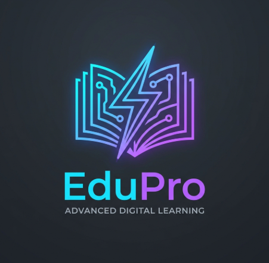

# <p align="center"><br>EduPro - Modern Eğitim ve Öğrenim Platformu</p>

EduPro, modern web teknolojileri ve göz alıcı bir tasarım dili (Glassmorphism / Buzlu Cam efekti) kullanılarak geliştirilmiş, duyarlı (responsive) bir **Eğitim Yönetim Sistemi (LMS) ve Öğrenci Kontrol Paneli** arayüz projesidir. 

Proje, öğrencilerin eğitim süreçlerini takip edebilecekleri, yeni kurslar keşfedebilecekleri, mevcut kurslarındaki ilerlemelerini görebilecekleri ve profil bilgilerini yönetebilecekleri tamamen özelleştirilmiş, modern bir kullanıcı deneyimi sunar.

---

## 🚀 Öne Çıkan Özellikler ve Sayfalar

Proje, bir öğrencinin ihtiyaç duyacağı tüm temel modülleri içeren 6 farklı sayfadan oluşmaktadır:

1. **Giriş Sayfası (`index.html`)**
   - Sade, şık ve modern bir kimlik doğrulama ekranı.
   - "Beni Hatırla" ve "Şifremi Unuttum" seçenekleri ile kullanıcı dostu arayüz.
   - Doğrudan ana sayfaya yönlendiren sorunsuz geçiş.

2. **Ana Sayfa / Kontrol Paneli (`home.html`)**
   - Öğrenciye özel kişiselleştirilmiş karşılama mesajı ("Hoş Geldiniz, Yağmur!").
   - **İstatistik Kartları:** Tamamlanan Kurslar, Sertifikalar ve Öğrenme Dakikası gibi kritik verilerin görsel takibi.
   - **Önerilen Kurslar:** En popüler ve güncel kursların sergilendiği dinamik kart yapısı.

3. **Tüm Kurslar Sayfası (`courses.html`)**
   - Veri Bilimi, Mobil, Tasarım, Oyun Geliştirme ve Siber Güvenlik gibi çeşitli kategorilerde geniş kurs yelpazesi.
   - Kategori filtreleme butonları ile kolay erişim.
   - Kurs kartlarında fiyatlandırma (Ücretli/Ücretsiz/Free) ve "Kayıt Ol" aksiyonları.

4. **Kurslarım Sayfası (`my-courses.html`)**
   - Öğrencinin aktif olarak devam ettiği kursların listesi.
   - Eğitmen bilgileri ve ders sayısının takibi.
   - **İlerleme Çubuğu (Progress Bar):** Kursun yüzde kaçının tamamlandığını dinamik olarak gösteren görsel ilerleme barları.

5. **Eğitmenler Sayfası (`instructors.html`)**
   - Platformda ders veren alanında uzman eğitmenlerin profilleri.
   - Eğitmenlerin uzmanlık alanları, değerlendirme puanları (yıldız bazlı) ve verdikleri kurs sayıları.
   - Sosyal kanıt sağlayan şık eğitmen kartları.

6. **Profil Sayfası (`profile.html`)**
   - Kullanıcının hesap bilgilerini yönetebileceği alan.
   - Fotoğraf değiştirme butonu ve Ad, Soyad, E-posta, Biyografi alanlarını içeren düzenlenebilir profil formu.

---

## 🎨 Tasarım Sistemi ve Teknolojiler

Proje, en yüksek görsel kaliteyi ve kullanıcı deneyimini sağlamak için sıfırdan özel CSS ile tasarlanmıştır:

- **Core (Çekirdek):** Semantik ve temiz HTML5 yapısı.
- **Styling (CSS):** Vanilla CSS3 kullanılarak oluşturulan modern tasarım sistemi.
  - **Glassmorphism:** Arka planlarda modern buzlu cam efekti (`backdrop-filter: blur`, yarı şeffaf sınırlar).
  - **Renk Paleti:** Uyumlu koyu/açık tonlar, modern gradyanlar ve marka kimliğini yansıtan vurgu renkleri.
  - **Duyarlı Tasarım (Responsive):** CSS Flexbox ve Grid sistemleri ile mobil, tablet ve masaüstü cihazlarla tam uyum.
  - **Mikro Etkileşimler:** Butonlarda ve kartlarda yumuşak geçiş efektleri (hover, transition).

---

## 📂 Proje Dizin Yapısı

```directory
ITP_Proje2/
│
├── assets/                  # Projede kullanılan tüm görsel varlıklar
│   ├── EduProLogo.png       # Platformun özgün logosu
│   ├── course1.png          # Modern AI & Machine Learning Kursu Görseli
│   ├── course2.jpg          # Pazarlama Stratejileri Kursu Görseli
│   ├── cybersecurity.png    # Siber Güvenlik Kursu Görseli
│   ├── datascience.png      # Veri Bilimi Kursu Görseli
│   ├── game.png             # Oyun Geliştirme Kursu Görseli
│   ├── mobile.png           # Mobil Geliştirme Kursu Görseli
│   ├── uiux.png             # UI/UX Tasarım Kursu Görseli
│   └── web_dev.png          # Web Geliştirme Kursu Görseli
│
├── index.html               # Giriş Sayfası
├── index.css                # Giriş Sayfası Stilleri
│
├── home.html                # Ana Sayfa / Kontrol Paneli
├── home.css                 # Ana Sayfa Stilleri
│
├── courses.html             # Tüm Kurslar Sayfası
├── courses.css              # Tüm Kurslar Stilleri
│
├── my-courses.html          # Kurslarım Sayfası
├── my-courses.css           # Kurslarım Stilleri
│
├── instructors.html         # Eğitmenler Sayfası
├── instructors.css          # Eğitmenler Stilleri
│
├── profile.html             # Profil Sayfası
├── profile.css              # Profil Sayfası Stilleri
│
├── common.css               # Ortak kullanılan stil tanımlamaları
└── .hintrc                  # Kod kalitesi ve standart yapılandırması
```

---

## 🖼️ Proje Görsel Galerisi

Projede yer alan ve eğitim kategorilerini temsil eden özgün görseller aşağıda listelenmiştir:

| Logo | Yapay Zeka & Makine Öğrenmesi | Web Geliştirme |
| :---: | :---: | :---: |
|  |  |  |

| Veri Bilimi | Siber Güvenlik | Mobil Geliştirme |
| :---: | :---: | :---: |
|  |  |  |

| UI/UX Tasarım | Oyun Geliştirme | Pazarlama |
| :---: | :---: | :---: |
|  |  |  |

---

## 💻 Projeyi Çalıştırma

Projeyi yerel bilgisayarınızda çalıştırmak oldukça basittir:

1. Bu depoyu klonlayın veya zip olarak indirin.
2. Proje ana dizininde bulunan **`index.html`** dosyasını herhangi bir web tarayıcısında (Chrome, Edge, Firefox, Safari vb.) çift tıklayarak açın.
3. Giriş ekranındaki bilgileri doldurarak (veya doğrudan **Giriş Yap** butonuna tıklayarak) EduPro dünyasını keşfetmeye başlayabilirsiniz!
